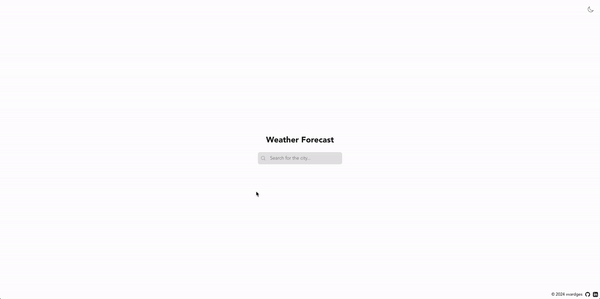

# Weather Forecast

###### ReactJs | Typescript | Vite | TailwindCSS App | Open Meteo API

This application lets you check the weather forecast for the location of your choice.

It displays a list of suggested cities (based on your input typed in a search form) and as one of them is clicked, application provides a 7 days forecast and current weather characteristics, such as: temperature, min and max temp, cloud cover, sunrise/sunset, wind, pressure, humidity and precipitation.

By default, it runs in a light mode but enables user to toggle the theme to dark mode.

## Preview

🔗 [Live demo](https://vvardges.github.io/hoory-weather-app/)



## Tech

This project was built with [Vite](https://vitejs.dev/).

#### Core technologies

- Vite
- ReactJs
- TypeScript
- Tailwind CSS
- Open Meteo API

## How to run

[Vite](https://vitejs.dev/guide/#scaffolding-your-first-vite-project) requires [Node.js](https://nodejs.org/en/) version 14.18+, 16+ to run.

Once you have the correct Node.js version installed, install all dependencies and devDependencies of the project in your project's directory:

```
npm i
```

To start the app in development mode run:

```
npm run dev
```

To view it in your browser, open http://localhost:3000.

### Scripts

`build`

```
npm run build
```

`lint`

```
npm run lint
```

`test`

```
npm run test
```

`test with coverage`

```
npm run test:coverage
```